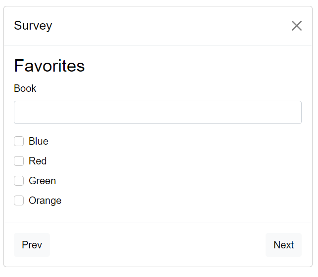

<h1 align="center">Survey</h1>

<div>

A multi-step survey script which can be added to any website!
Built with:

- Webpack
- React
- Bootstrap 5
- Typescript


## 🔨 Usage

Just add the dist/bundle.js in your html

```
<!DOCTYPE html>
<html>
	<head>
		<title>Survey</title>
	</head>
	<body>
		<p>Your content here</p>
		<script src="./bundle.js"></script>
	</body>
</html>
```

## ⌨️ Development

Just clone this repo and...

```bash
$ npm install
$ npm start
```

Open your browser and visit http://localhost:8080

And to build a new bundle version:

```bash
$ npm run build
```

## Screenshots





## TODO
Add test coverage
